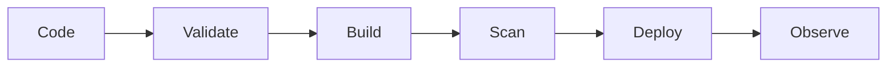

<div align="center">

[](https://git.io/typing-svg)

[](https://linkedin.com/in/ssv1802)
[](https://github.com/viho-kernel)


</div>

<br/>


## whoami

Cloud & DevOps engineer focused on secure, repeatable delivery across AWS, infrastructure as code, containers, CI/CD, and observability. I bring **4+ years of enterprise IT infrastructure experience** and treat every project like an operational system: build it, validate it, monitor it, and document the failure modes.

```yaml
engineering_focus:
  cloud:        [AWS, VPC, IAM, ALB, Auto Scaling, Route 53]
  automation:   [Terraform, Ansible, Python, Bash]
  delivery:     [GitHub Actions, Jenkins, Maven, SonarQube, JFrog]
  platforms:    [Docker, Kubernetes, EKS, Helm]
  reliability:  [Prometheus, Grafana, CloudWatch, Trivy]
```

<br clear="right"/>

## Platform delivery flow



<div align="center">


</div>

## Featured builds

| Project | Engineering focus | Current stage |
|---|---|---|
| [**PlatformForge**](https://github.com/viho-kernel/PlatformForge) | Hardened Docker workloads, Kubernetes storage, health checks, observability, and image security | Building end-to-end |
| [**AWS Portfolio**](https://github.com/viho-kernel/AWS-Portfolio-Project) | Portfolio delivery workflow, repository security, and GitHub Actions validation | Active |
| [**Cloud Analytics**](https://github.com/viho-kernel/cloudbased-analytics-project) | Streamlit, S3, SNS, environment-based configuration, CI, and secure repo practices | Active |
| **Roboshop Platform** | Terraform, Ansible, AWS multi-tier networking, ALB, Auto Scaling, and remote state | Consolidating |
| **Secure CI/CD Delivery** | Jenkins, SonarQube, JFrog, Docker, and automated delivery controls | Consolidating |

## Engineering standards

<div align="center">

GitHub Actions · Terraform validation · Trivy scanning · Checkov policy checks · SBOMs · Dependabot · Secrets hygiene · Evidence-based READMEs

</div>

## GitHub pulse

<div align="center">


<br/>

[](https://git.io/streak-stats)

</div>

## Certifications

AWS Certified Solutions Architect – Associate · AWS Certified Cloud Practitioner · CCNA · Microsoft Azure Fundamentals · Google Cloud Digital Leader

<div align="center">

<br/>

**Build reliable. Automate deliberately. Secure by default.**


</div>